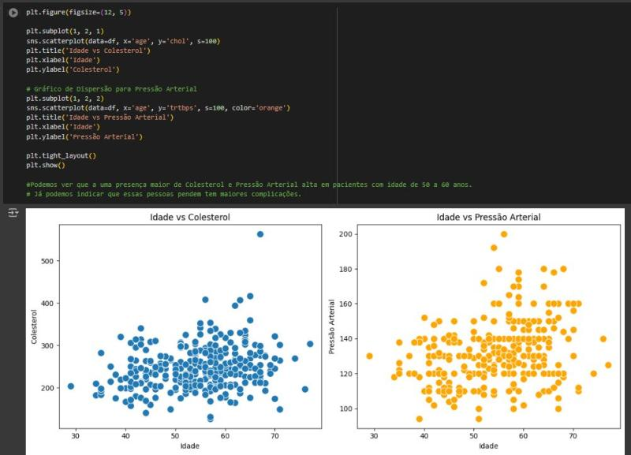
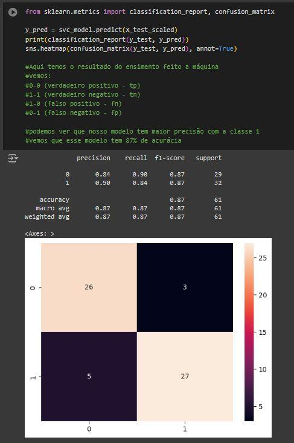
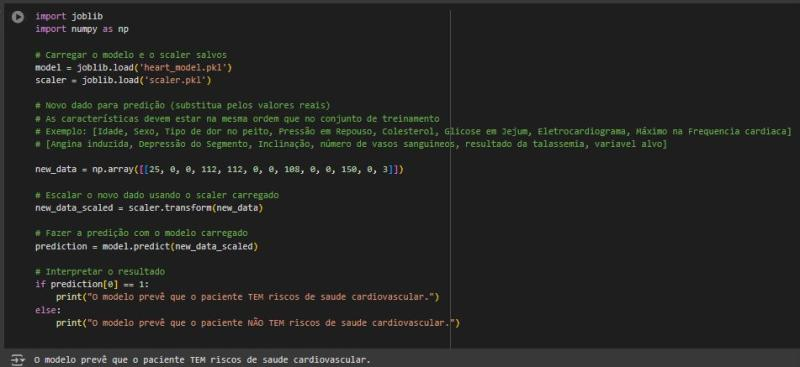

# Projeto-IACardiaca
 
# IACardiaca- Saúde Cardiaca!

## Descritivo:

Neste projeto, busquei ajudar a diagnosticar pessoas com riscos cardíacos por meio de uma Inteligência Artificial que analisa os dados fornecidos, como peso, pressão arterial, colesterol, entre outros. Além disso, utilizei essas informações para gerar gráficos, facilitando a leitura dos resultados.
O projeto foi desenvolvido no Google Colab, a fim de facilitar a leitura de arquivos JSON e CSV. Iniciei o trabalho pesquisando por dados reais no Kaggle, uma plataforma com diversos datasets, onde encontrei uma ótima fonte de informações com vários tipos de parâmetros para comparação. Realizei o tratamento dos dados, removendo aqueles que prejudicavam a análise. Para visualizar os tipos de dados e preparar os gráficos, implementei uma IA capaz de analisar as informações e indicar se o paciente corre risco cardíaco. Para isso, utilizei Python e algumas bibliotecas, como Pandas, NumPy, Seaborn e Scikit-Learn (SKLearn).

Durante o desenvolvimento do projeto, fui orientado pelo professor Felipe Amaral.

## Tecnologias:

**Técnicos**: Python · Inteligência artificial · Análise de dados · Estatística  · Ciência de dados

**Blibiotecas**: SKLearn · Pandas · NumPy

## Gráfico:
**Descrição**: Aqui temos os gráficos gerados a partir das bibliotecas, onde podemos ver algumas comparações, entre idade, colesterol e pressão arterial. 

## Treinando a IA:
**Descrição**: Separação e treinamento da IA com os dados fornecidos, e sua acurácia da IA em dizer se a pessoa é cardíaca ou não.

## Conclusão:
**Descrição**: Na imagem abaixo, realizei o preenchimento dos dados solicitados e podemos ver que resultou numa em riscos vascular.

